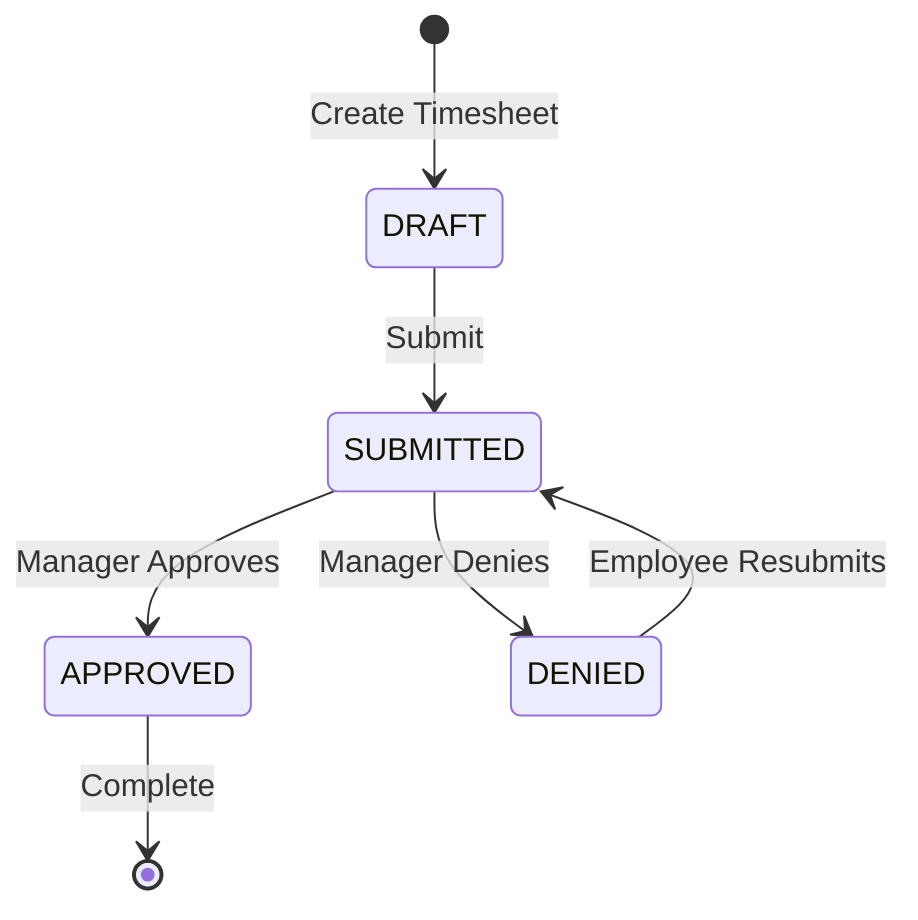

# 🏢 HRMS - Human Resource Management System


A comprehensive Human Resource Management System with modern frontend and robust backend architecture. The system provides complete employee management, timesheet tracking, payroll processing, and role-based access control.

## Table of Contents

- [Project Overview](#-project-overview)
- [Architecture](#-architecture)
- [Tech Stack](#-tech-stack)
- [Features](#-features)
- [API Documentation](#-api-documentation)
- [Setup Instructions](#-setup-instructions)
- [Running the Application](#-running-the-application)
- [Project Structure](#-project-structure)
- [User Roles & Permissions](#-user-roles--permissions)
- [Screenshots](#-screenshots)

## Project Overview

HRMS is a full-stack application designed to streamline HR operations including:

- **Employee Management** - Create, update, and manage employee profiles
- **Timesheet Tracking** - Weekly timesheet submission and approval workflow
- **Payroll Processing** - Automated payroll calculations and history
- **Role-Based Access** - Three distinct roles with specific permissions
- **Secure Authentication** - JWT-based authentication with refresh tokens

## Tech Stack

### Frontend

| Technology | Version | Purpose |
|------------|---------|---------|
| React | 19.2.0 | UI Library |
| TypeScript | 5.9.3 | Type Safety |
| Vite | 7.2.4 | Build Tool |
| TanStack Query | 5.90.11 | Server State Management |
| React Router | 7.9.6 | Client-side Routing |
| Tailwind CSS | 4.1.17 | Styling |
| shadcn/ui | Latest | UI Components |
| Axios | 1.13.2 | HTTP Client |
| Lucide React | 0.555.0 | Icons |
| react-hot-toast | 2.6.0 | Notifications |

### Backend

| Technology | Version | Purpose |
|------------|---------|---------|
| Spring Boot | 3.5.8 | Application Framework |
| Java | 21 | Programming Language |
| Spring Security | 6.x | Authentication & Authorization |
| Spring Data JPA | 3.x | Database ORM |
| PostgreSQL | Latest | Database |
| JWT (jjwt) | 0.12.6 | Token Authentication |
| Lombok | Latest | Boilerplate Reduction |
| springdoc-openapi | 2.8.8 | API Documentation |
| HikariCP | Default | Connection Pooling |

## Features

### Authentication & Security

- JWT-based authentication with access and refresh tokens
- Secure password hashing with BCrypt
- Role-based access control (RBAC)
- First-time login password reset enforcement
- Multi-device logout support

### Employee Management

- Complete employee profiles (personal, contact, pay info)
- Employee creation with auto-generated credentials
- Manager-employee hierarchy
- Search and filter employees
- Role management (Employee, Manager, Admin)

### Timesheet Management

- Weekly timesheet format (Monday - Sunday)
- Daily hours entry with descriptions
- Hours validation (0-24 per day)
- Draft save functionality
- Submit for approval workflow
- Denial with mandatory reason
- Resubmission of denied timesheets

### Payroll Processing

- Payroll preview before execution
- Automated payroll calculation
- Overtime calculation (hours > 40/week)
- Payroll history and reports
- Mark payroll as paid

### Manager Features

- View direct reports
- Review team timesheets
- Approve/Deny timesheets with comments
- Team statistics dashboard

### Admin Features

- Full employee CRUD operations
- Payroll administration
- System-wide statistics
- User management

## API Documentation

### Interactive API Documentation (Swagger UI)

Once the backend is running, access the Swagger UI at:

```
http://localhost:8080/swagger-ui.html
```

### API Endpoints Overview

#### Authentication APIs (`/api/auth`)

| Method | Endpoint | Description | Auth Required |
|--------|----------|-------------|---------------|
| POST | `/api/auth/login` | User login | ❌ |
| POST | `/api/auth/refresh` | Refresh access token | ❌ |
| POST | `/api/auth/logout` | Logout current session | ❌ |
| POST | `/api/auth/logout-all` | Logout all devices | ✅ |
| POST | `/api/auth/reset-password` | Reset password | ✅ |
| GET | `/api/auth/requires-password-reset` | Check if reset required | ✅ |
| GET | `/api/auth/health` | Health check | ❌ |

#### Employee APIs (`/api/employee`)

| Method | Endpoint | Description | Roles |
|--------|----------|-------------|-------|
| GET | `/api/employee/dashboard` | Get dashboard data | All |
| GET | `/api/employee/personal-info` | Get personal info | All |
| GET | `/api/employee/pay-info` | Get pay information | All |
| GET | `/api/employee/contact-info` | Get contact info | All |
| PUT | `/api/employee/contact-info` | Update contact info | All |
| GET | `/api/employee/profile` | Get complete profile | All |

#### Timesheet APIs (`/api/employee/timesheet`)

| Method | Endpoint | Description | Roles |
|--------|----------|-------------|-------|
| GET | `/api/employee/timesheet/current` | Get current week timesheet | All |
| GET | `/api/employee/timesheet/{id}` | Get timesheet by ID | All |
| GET | `/api/employee/timesheet/history` | Get timesheet history | All |
| PUT | `/api/employee/timesheet/{id}` | Update timesheet | All |
| POST | `/api/employee/timesheet/{id}/submit` | Submit for approval | All |

#### Manager APIs (`/api/manager`)

| Method | Endpoint | Description | Roles |
|--------|----------|-------------|-------|
| GET | `/api/manager/employees` | Get direct reports | Manager, Admin |
| GET | `/api/manager/timesheets` | Get team timesheets | Manager, Admin |
| GET | `/api/manager/timesheets/pending/count` | Get pending count | Manager, Admin |
| GET | `/api/manager/timesheets/{id}` | Get timesheet details | Manager, Admin |
| POST | `/api/manager/timesheets/{id}/approve` | Approve timesheet | Manager, Admin |
| POST | `/api/manager/timesheets/{id}/deny` | Deny timesheet | Manager, Admin |
| GET | `/api/manager/statistics` | Get manager stats | Manager, Admin |

#### Admin Employee APIs (`/api/admin/employees`)

| Method | Endpoint | Description | Roles |
|--------|----------|-------------|-------|
| GET | `/api/admin/employees` | Get all employees | Admin |
| GET | `/api/admin/employees/{id}` | Get employee by ID | Admin |
| POST | `/api/admin/employees` | Create new employee | Admin |
| PUT | `/api/admin/employees/{id}/personal-info` | Update personal info | Admin |
| PUT | `/api/admin/employees/{id}/pay-info` | Update pay info | Admin |
| GET | `/api/admin/employees/managers` | Get active managers | Admin |
| GET | `/api/admin/employees/statistics/count-by-role` | Get statistics | Admin |

#### Admin Payroll APIs (`/api/admin/payroll`)

| Method | Endpoint | Description | Roles |
|--------|----------|-------------|-------|
| GET | `/api/admin/payroll/preview` | Preview payroll | Admin |
| POST | `/api/admin/payroll/run` | Run payroll | Admin |
| GET | `/api/admin/payroll/{id}` | Get payroll by ID | Admin |
| GET | `/api/admin/payroll/history` | Get payroll history | Admin |
| PATCH | `/api/admin/payroll/{id}/mark-paid` | Mark as paid | Admin |
| GET | `/api/admin/payroll/current-week` | Current week status | Admin |

#### Employee Payroll APIs (`/api/employee/payroll`)

| Method | Endpoint | Description | Roles |
|--------|----------|-------------|-------|
| GET | `/api/employee/payroll/history` | Get payroll history | All |
| GET | `/api/employee/payroll/{id}` | Get payroll by ID | All |

## Setup Instructions

### Prerequisites

- **Java 21** - [Download OpenJDK](https://adoptium.net/)
- **Node.js 20+** - [Download Node.js](https://nodejs.org/)
- **PostgreSQL 14+** - [Download PostgreSQL](https://www.postgresql.org/)
- **Maven 3.9+** (or use included wrapper)
- **Git**

### Database Setup

1. Create a PostgreSQL database:

```sql
CREATE DATABASE hrms_db;
CREATE USER hrms_user WITH PASSWORD 'your_password';
GRANT ALL PRIVILEGES ON DATABASE hrms_db TO hrms_user;
```

1. The application uses Hibernate's `ddl-auto=update` to auto-create tables on first run.

### Backend Setup

1. Navigate to the backend directory:

```bash
cd hrms
```

1. Create a `.env` file or set environment variables:

```bash
# Database Configuration
POSTGRES_URL=jdbc:postgresql://localhost:5432/hrms_db
POSTGRES_USER=hrms_user
POSTGRES_PASSWORD=your_password

# JWT Configuration
JWT_SECRET=your-256-bit-secret-key-for-jwt-signing
JWT_ACCESS_TOKEN_EXPIRATION=900000        # 15 minutes in ms
JWT_REFRESH_TOKEN_EXPIRATION=604800000    # 7 days in ms

# HikariCP Configuration
HIKARI_MAX_POOL_SIZE=10
HIKARI_MIN_IDLE=5
HIKARI_CONNECTION_TIMEOUT=30000
HIKARI_IDLE_TIMEOUT=600000
HIKARI_MAX_LIFETIME=1800000


```

1. Build the application:

```bash
./mvnw clean install -DskipTests
```

### Frontend Setup

1. Navigate to the frontend directory:

```bash
cd hrms-frontend
```

1. Install dependencies:

```bash
npm install
```

1. Configure API base URL (if different from default):
Edit `src/api/client.ts` if your backend runs on a different port.

## Running the Application

### Start Backend

```bash
cd hrms
./mvnw spring-boot:run
```

The backend will start at `http://localhost:8080`

### Start Frontend

```bash
cd hrms-frontend
npm run dev
```

The frontend will start at `http://localhost:5173`

### Default Admin Account

On first startup, a default admin account is created:

- **Username:** `admin`
- **Password:** `admin123`

> **Important:** Change the default password immediately after first login!

## Project Structure

### Backend (`/hrms`)

```
hrms/
├── src/main/java/com/example/hrms/
│   ├── config/              # Configuration classes
│   │   ├── DataInitializer.java
│   │   ├── JwtProperties.java
│   │   ├── JwtTokenProvider.java
│   │   ├── OpenApiConfig.java
│   │   ├── SecurityConfig.java
│   │   └── WebConfig.java
│   ├── controllers/         # REST API controllers
│   │   ├── AdminEmployeeController.java
│   │   ├── AdminPayrollController.java
│   │   ├── AuthController.java
│   │   ├── EmployeeController.java
│   │   ├── ManagerController.java
│   │   ├── PayrollEmployeeController.java
│   │   └── TimesheetController.java
│   ├── dto/                 # Data Transfer Objects
│   ├── exceptions/          # Custom exceptions & handlers
│   ├── mappers/            # Entity-DTO mappers
│   ├── models/             # JPA entities
│   │   ├── Employee.java
│   │   ├── Timesheet.java
│   │   ├── TimesheetEntry.java
│   │   ├── Payroll.java
│   │   └── ...
│   ├── repositories/        # Spring Data JPA repositories
│   ├── security/           # Security filters & handlers
│   ├── services/           # Business logic
│   └── utils/              # Utility classes
├── src/main/resources/
│   └── application.properties
└── pom.xml
```

### Frontend (`/hrms-frontend`)

```
hrms-frontend/
├── src/
│   ├── api/                 # API client & services
│   │   ├── client.ts        # Axios configuration
│   │   └── services/        # API service functions
│   ├── components/
│   │   ├── auth/            # Auth components (guards)
│   │   ├── common/          # Reusable components
│   │   ├── layout/          # Layout components
│   │   └── ui/              # shadcn/ui components
│   ├── contexts/            # React contexts
│   │   └── AuthContext.tsx
│   ├── hooks/               # Custom React hooks
│   │   ├── useAuth.ts
│   │   ├── useEmployee.ts
│   │   ├── useTimesheet.ts
│   │   ├── useManager.ts
│   │   └── useAdmin.ts
│   ├── pages/               # Page components
│   │   ├── admin/           # Admin pages
│   │   ├── auth/            # Login, Reset password
│   │   ├── dashboard/       # Dashboard
│   │   ├── landing/         # Landing page
│   │   ├── manager/         # Manager pages
│   │   ├── payroll/         # Payroll pages
│   │   ├── profile/         # Profile pages
│   │   └── timesheet/       # Timesheet pages
│   ├── routing/             # React Router config
│   ├── types/               # TypeScript types
│   ├── App.tsx
│   └── main.tsx
├── package.json
├── tsconfig.json
└── vite.config.ts
```

## User Roles & Permissions

| Feature | Employee | Manager | Admin |
|---------|:--------:|:-------:|:-----:|
| View own dashboard | ✅ | ✅ | ✅ |
| View/update own profile | ✅ | ✅ | ✅ |
| View own pay information | ✅ | ✅ | ✅ |
| Update contact information | ✅ | ✅ | ✅ |
| Create/edit own timesheets | ✅ | ✅ | ✅ |
| Submit timesheets | ✅ | ✅ | ✅ |
| View own timesheet history | ✅ | ✅ | ✅ |
| View own payroll history | ✅ | ✅ | ✅ |
| View direct reports | ❌ | ✅ | ✅ |
| Review team timesheets | ❌ | ✅ | ✅ |
| Approve/deny timesheets | ❌ | ✅ | ✅ |
| View team statistics | ❌ | ✅ | ✅ |
| Manage all employees | ❌ | ❌ | ✅ |
| Create new employees | ❌ | ❌ | ✅ |
| Update employee information | ❌ | ❌ | ✅ |
| Run payroll | ❌ | ❌ | ✅ |
| View all payroll history | ❌ | ❌ | ✅ |
| Access Swagger UI | ✅ | ✅ | ✅ |

### Timesheet Status Workflow



## Screenshots

> Screenshots coming soon! This section will be updated with:
>
> - Landing page
> - Login page
> - Employee dashboard
> - Timesheet management
> - Manager approval view
> - Admin employee management
> - Payroll processing

## Security Features

- **JWT Authentication** - Stateless authentication using JSON Web Tokens
- **Password Encryption** - BCrypt hashing for all passwords
- **CORS Configuration** - Configurable cross-origin resource sharing
- **Role-Based Authorization** - Method-level security with @PreAuthorize
- **Token Refresh** - Automatic token refresh mechanism
- **Secure Headers** - Spring Security default headers enabled

## Contributing

1. Fork the repository
2. Create your feature branch (`git checkout -b feature/AmazingFeature`)
3. Commit your changes (`git commit -m 'Add some AmazingFeature'`)
4. Push to the branch (`git push origin feature/AmazingFeature`)
5. Open a Pull Request

## License

This project is licensed under the MIT License - see the [LICENSE](LICENSE) file for details.

---

<p align="center">
  Made with ❤️ by Gangadhar using Spring Boot and React
</p>
